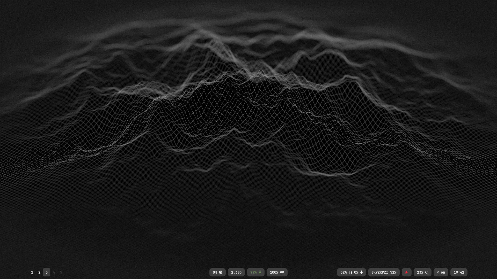

# Dotfiles

A lot of this was inspired by other users, though theses are my personal dotfiles for Arch Linux + Hyprland.

## Includes
- **Hyprland** (`~/.config/hypr/`)
- **Kitty** (`~/.config/kitty/`)
- **Neovim** (`~/.config/nvim/`)
- **Waybar** (`~/.config/waybar/`)
- **Zsh** (`~/.zshrc`)
- **Wallpapers** (`dark.jpg`)


## Screenshots



## Usage
Clone the repo:

```bash
git clone https://github.com/parasladwa/dotfiles.git

